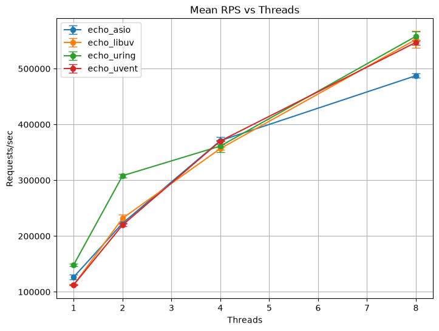

# io_perfomance

Reproducible throughput/latency comparison of async I/O libraries on the same minimal workload — an HTTP/1.1 keep-alive
"echo" server hammered by [wrk](https://github.com/wg/wrk).

Servers under test (`src/echo_tcp/`):

| Binary       | Library                                                                               | Threading model                                                                            |
|--------------|---------------------------------------------------------------------------------------|--------------------------------------------------------------------------------------------|
| `echo_uvent` | [uvent](https://github.com/Usub-Foundation/uvent) (C++23 coroutines), `epoll` backend | N worker threads, one `TCPServerSocket` acceptor per thread (`SO_REUSEPORT`)               |
| `echo_uring` | same source built with `-DUVENT_ENABLE_IO_URING=ON`                                   | same                                                                                       |
| `echo_asio`  | Boost.Asio (callbacks)                                                                | one `io_context`, N threads calling `run()`                                                |
| `echo_libuv` | libuv 1.49 (C callbacks)                                                              | N independent `uv_loop_t`, one per thread, each with its own listener (`UV_TCP_REUSEPORT`) |

Every server reads a request, answers a fixed 20-byte JSON body, keeps the connection open. No parsing, no allocation
per
request — the numbers measure the event loop and syscall path, nothing else.

## Results

| Threads | uvent (epoll) RPS | uvent (io_uring) RPS | Boost.Asio RPS | libuv RPS | uvent (epoll) p99 | uvent (io_uring) p99 | Boost.Asio p99 | libuv p99 |
|--------:|------------------:|---------------------:|---------------:|----------:|------------------:|---------------------:|---------------:|----------:|
|       1 |           112,594 |              149,538 |        124,480 |   112,182 |          10.86 ms |              8.44 ms |        9.46 ms |  11.13 ms |
|       2 |           220,534 |              307,174 |        222,923 |   232,590 |           5.43 ms |              3.93 ms |        5.41 ms |   5.42 ms |
|       4 |           370,127 |              364,552 |        373,909 |   356,399 |           2.73 ms |              2.76 ms |        2.84 ms |   4.38 ms |
|       8 |           549,151 |              562,466 |        485,974 |   559,106 |           2.01 ms |              1.96 ms |        2.30 ms |   2.41 ms |



Host: 1× Intel Xeon E5-2640 v4 (10 cores / 20 threads, 2.4 GHz), Linux 6.8, GCC 13.3, `-O3 -march=native` + LTO;
uvent 4.1.0 (both backends from the same source), Boost 1.83, libuv 1.49.2, liburing 2.15. Measured 2026-09-23.
`wrk -t4 -c1000 -d30s --latency` (`-t8` for the 8-thread row), 3 s warm-up, server and `wrk` on the same host; for the
1/2/4-thread rows wrk is pinned to cores 5–9/15–19 (`WRK_CPUS`), away from the workers and their SMT siblings; the
8-thread row cannot be separated on 10 cores and runs with wrk free-floating.
Every cell is the **median of 3 runs on an idle host** (Boost.Asio at 2 threads: median of 5, the very first run of
the session – 186k RPS, p99 55 ms, no `wrk` errors – was discarded as a cold-start artefact); run-to-run spread was within
±3 % for every cell and no run had a single `wrk` timeout. Treat differences under ~3 % as noise.
The CSV behind the table is `images/summary_agg.csv`; raw `wrk` output stays in `results/` on the machine that ran it.

Reading the table:

- **1–2 threads: uvent + io_uring is the fastest server here** (150k / 307k RPS) – 20–38 % over Boost.Asio,
  32–33 % over libuv and 33–39 % over its own `epoll` build. The io_uring backend batches submissions and completions
  and skips the speculative `recv()`/`epoll_wait` round trips the readiness-based loops pay per request.
- **1–2 threads, `epoll` build:** level with libuv on one thread (113k vs 112k) and 10 % behind Asio; on two threads
  it is level with Asio (221k vs 223k) and 5 % behind libuv. The kernel path is identical (one `recv`, one `send` per
  request); the difference is a few hundred nanoseconds of user-space work per request – coroutine frames and the
  scheduler round trip, the price of `co_await`, not of the loop.
- **4 threads:** all four are within 5 % (356–374k); the loop stops mattering once four cores are busy.
- **8 threads** (where `wrk` competes for the same 10 cores): uvent io_uring, libuv and uvent epoll sit at 549–562k;
  Asio's single shared `io_context` falls behind (486k) with a visibly worse p99.

Earlier versions of this repo showed libuv at a few hundred RPS. That was an artifact of the old single-loop
`echo_libuv` and how it was run, not a property of libuv; the server has been rewritten (one loop per thread,
`UV_TCP_REUSEPORT`) and every number above was re-measured with it.

## Build

```bash
cmake -B build -DCMAKE_BUILD_TYPE=Release -DWITH_UVENT=ON -DWITH_ASIO=ON -DWITH_LIBUV=ON -DENABLE_LTO=ON
cmake --build build -j
```

uvent and libuv are fetched with `FetchContent`; Boost must be installed (`libboost-system-dev` or equivalent).

io_uring variant (kernel 5.1+, [liburing](https://github.com/axboe/liburing)); built separately because the backend is a
compile-time switch in uvent:

```bash
cmake -B build-uring -DCMAKE_BUILD_TYPE=Release -DWITH_UVENT=ON -DWITH_ASIO=OFF -DWITH_LIBUV=OFF -DENABLE_LTO=ON \
      -DUVENT_ENABLE_IO_URING=ON   # + -DURING_LIB=/path/liburing.a -DCMAKE_CXX_FLAGS=-I/path/include if liburing is not system-wide
cmake --build build-uring -j --target echo_uvent
cp build-uring/echo_uvent build/echo_uring
```

To bench a custom set of binaries: `BINS="./build/echo_uvent ./build/echo_uring" scripts/run_all.sh`.

## Run

```bash
chmod +x scripts/*.sh
ulimit -n 65535                      # 1000 connections + wrk on the same host
```

All libraries, full thread matrix (one `wrk` run per cell, results in `results/*.txt`, server logs in `logs/`):

```bash
# what the table above was measured with (10c/20t host, SMT siblings are i and i+10):
WRK_CPUS=5-9,15-19 THREADS_LIST="1 2 4" CONN=1000 DUR=30s WARMUP=3s scripts/run_all.sh   # wrk kept off the workers' cores
                   THREADS_LIST="8"     CONN=1000 DUR=30s WARMUP=3s scripts/run_all.sh   # 8 workers + wrk can't be separated on 10 cores
```

One library:

```bash
THREADS=8 CONN=1000 DUR=30s scripts/run_one.sh ./build/echo_libuv
```

`run_one.sh` starts the server, waits for the port, runs `wrk -t$WRK_THREADS -c$CONN -d$DUR --latency`, then stops the
server. `--threads N` is passed to every binary, so all three scale on the same terms. `WRK_THREADS` defaults to
`max(4, THREADS)`: with `-t1` wrk itself caps out around 110k RPS and would hide the difference between servers.
`WRK_CPUS` (optional) runs wrk under `taskset -c`; keep it off the server's cores *and their SMT siblings* — a worker
sharing a physical core with a wrk thread loses ~6 % RPS and its p99 doubles, and it shows up as run-to-run bimodality.

For a quieter box see `scripts/sys_tune_example.sh` (somaxconn, syn backlog, `tcp_tw_reuse`).

## Summarize & plot

```bash
scripts/summarize.sh                                   # results/*.txt -> results/summary.csv
python3 -m venv .venv && .venv/bin/pip install pandas matplotlib
.venv/bin/python scripts/analyze.py --in results/summary.csv --out images --max-threads 8
```

`analyze.py` writes `rps_mean.png`, `rps_median.png`, `p99_vs_threads.png` (several runs per cell are averaged).

## Caveats

- `wrk` runs on the same host as the server. Keep it on its own physical cores (`WRK_CPUS`, mind SMT siblings) while
  `server threads + wrk threads ≤ physical cores`; beyond that (the 8-thread row here) the load generator competes with
  the servers and the numbers are "whole box" numbers. A second machine is the real fix.
- This is a best-case, parse-free workload. It says nothing about HTTP parsing, TLS, or application logic — only about
  how
  cheaply each library moves bytes through `epoll`.
- Run-to-run jitter on a desktop with an IDE and browsers open is easily ±10 %; the table above is the median of
  several runs per cell. Repeat and take medians before drawing conclusions from small deltas.
- Server ports default to 28000+, *below* `ip_local_port_range`: with 1000 client connections per run wrk's ephemeral
  ports will otherwise eventually land on the next server's port and the server dies with
  `bind(): Address already in use`.
